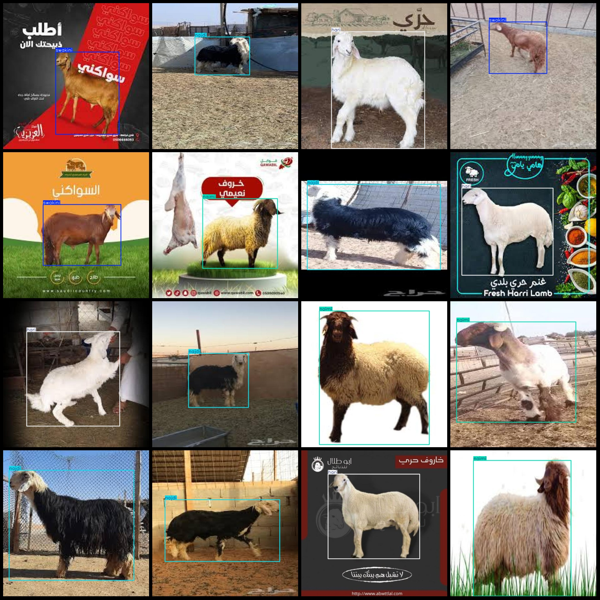
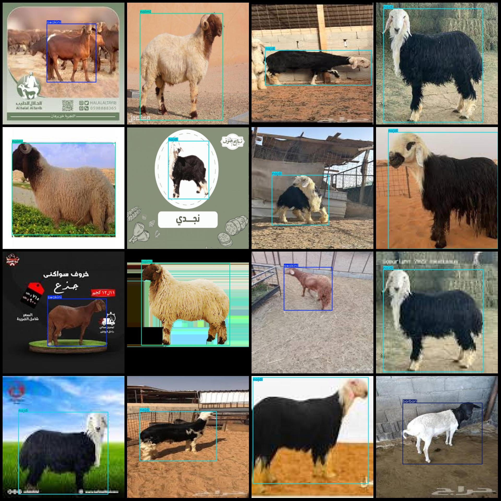

# Sheep Breed Detection Dataset (VOC+YOLO) - 314 Images in 5 Classes

Dataset format: Pascal VOC format + YOLO format (txt file without split path, only containing jpg images and corresponding VOC format xml files and yolo format txt files).

Number of images (jpg file count): 314
Number of annotations (xml file count): 314
Number of annotations (txt file count): 314
Number of annotation categories: 5
Annotation category names (note that the order of categories in the yolo format does not correspond to this, but is based on the "labels" folder's "classes.txt"): ["barbari", "hari", "naimi", "najdi",
 "swakini"]
Number of bounding boxes per category:
- Barbarii (Barbarian sheep) = 14
- Hari (Hari sheep) = 63
- Naimi (Naiman sheep) = 70
- Najdi (Najdi sheep) = 106
- Swakini (Swakini sheep) = 63
Total bounding boxes: 316
Number of images per category:
- Barbarii (Barbarian sheep) = 14
- Hari (Hari sheep) = 63
- Naimi (Naiman sheep) = 69
- Najdi (Najdi sheep) = 106
- Swakini (Swakini sheep) = 63
Image resolution: 640x640
Annotation tool used: labelImg
Annotation rules: Drawing a rectangle around the category
Important note: The dataset does not have separate training/validation/test sets; you will need to divide them yourself.
Special declaration: This dataset does not guarantee any accuracy of the trained model or weight files.
Image preview:

## Images

Here is a pay link on Stripe ( https://buy.stripe.com/3cs8yP7sY87d0vu9AB ). Please contact me lonlonago@foxmail.com after funding $89, and I will send you a complete data files , thank you!

